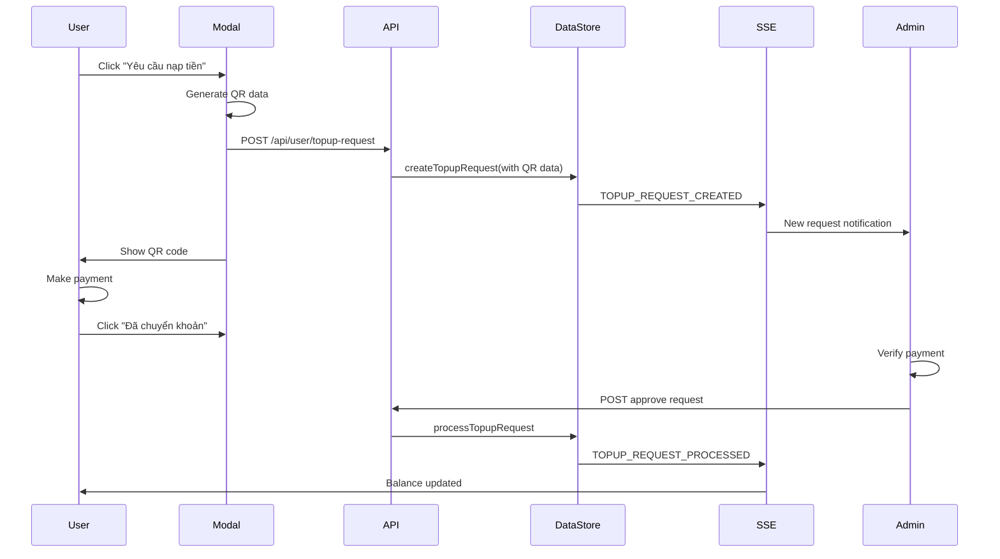

# Unified Top-up Request System with QR Code Integration

## 🎯 Overview

The unified top-up request system combines QR code generation with the formal admin approval process, creating a seamless workflow where users can generate payment QR codes while simultaneously creating approval requests for administrators.

## 🔄 Unified Workflow

### 1. User Initiates Request

**Single Action**: User clicks "Yêu cầu nạp tiền" (Request Top-up) button

**What Happens**:
```typescript
// User fills form and submits
const response = await fetch("/api/user/topup-request", {
  method: "POST",
  body: JSON.stringify({
    amount: 100000,
    notes: "Cần nạp tiền để mua gói premium",
    qrCodeData: "VCB|1234567890|CONG TY TNHH ACC STORE|100000|NAPTHE USER123",
    transferContent: "NAPTHE USER123",
    bankInfo: {
      bankName: "Vietcombank",
      accountNumber: "1234567890",
      accountName: "CONG TY TNHH ACC STORE",
      bankCode: "VCB"
    }
  })
});

// System creates unified request
const request = dataStore.createTopupRequest({
  userId: user.id,
  requestedAmount: amount,
  status: "pending", // Chờ duyệt
  qrCodeData,
  transferContent,
  bankInfo,
  userNotes: notes
});
```

### 2. Immediate QR Code Display

**User Experience**:
- ✅ Request created successfully message
- ✅ QR code displayed for immediate payment
- ✅ Bank transfer information shown
- ✅ Copy buttons for account number and transfer content
- ✅ Request added to history with "Chờ duyệt" status

**QR Code Features**:
- 📱 Scannable QR code for mobile banking apps
- 💾 Download QR code as PNG image
- 📋 Copy QR data and transfer content
- 🏦 Complete bank information display
- ⚠️ Important payment instructions

### 3. Admin Notification & Review

**Admin Dashboard**: Request appears immediately with QR context

**Enhanced Admin View**:
```typescript
// Admin sees request with QR information
{
  id: "topup-123",
  userName: "Nguyễn Văn A",
  userEmail: "user@example.com",
  requestedAmount: 100000,
  status: "pending",
  qrCodeData: "VCB|1234567890|...",
  transferContent: "NAPTHE USER123",
  bankInfo: {
    bankName: "Vietcombank",
    accountNumber: "1234567890",
    // ...
  },
  userNotes: "Cần nạp tiền để mua gói premium",
  createdAt: "2024-01-20T10:30:00Z"
}
```

**Admin Benefits**:
- 🔍 **Payment Context**: See exact QR code and transfer details
- 📊 **Bank Information**: Know which account to check for payment
- 🏷️ **Transfer Content**: Easily identify payments with unique codes
- ⏰ **Timestamp**: Know when QR was generated for payment tracking

### 4. Payment Confirmation Process

**User Payment Flow**:
1. User scans QR code or manually transfers money
2. User clicks "Đã chuyển khoản" (Payment Completed)
3. Request remains in "Chờ duyệt" (Pending) status
4. Admin receives notification of payment claim

**Admin Verification**:
1. Admin checks bank account for incoming transfer
2. Admin matches transfer content with request
3. Admin verifies amount matches requested amount
4. Admin approves or rejects based on payment verification

### 5. Admin Approval with Balance Update

**Approval Process**:
```typescript
// Admin confirms payment received and approves
const result = dataStore.processTopupRequest(
  requestId,
  "approve",
  adminId,
  adminName,
  {
    approvedAmount: 100000, // Can modify if needed
    adminNotes: "Payment verified - received via Vietcombank"
  }
);

// System updates user balance
const newBalance = user.balance + approvedAmount;
dataStore.updateUser(userId, { balance: newBalance });

// System creates transaction record
const transaction = dataStore.createTransaction({
  userId,
  type: "credit",
  amount: approvedAmount,
  description: "Nạp tiền theo yêu cầu: " + userNotes,
  adminId,
  metadata: {
    topupRequestId: requestId,
    qrCodeData: request.qrCodeData,
    transferContent: request.transferContent,
    paymentMethod: "bank_transfer"
  }
});
```

## 🎨 User Interface Integration

### Account Page Changes

**Before**: Separate QR generation and top-up request buttons
**After**: Single unified "Yêu cầu nạp tiền" button

```typescript
// Replaced old deposit link
<Link href="/deposit">Nạp tiền</Link>

// With unified button
<button onClick={() => setShowTopupModal(true)}>
  Yêu cầu nạp tiền - Tạo QR code và gửi yêu cầu
</button>
```

### Enhanced Modal Experience

**TopupRequestModal Features**:
- 📝 **Amount Input**: With quick amount buttons
- 💬 **Notes Field**: User can add payment context
- 🔄 **Two-Phase UI**: Form → QR Code display
- 📱 **QR Code Generator**: Instant QR creation
- 🏦 **Bank Details**: Complete transfer information
- 📋 **Copy Functions**: Easy payment execution
- ✅ **Success Feedback**: Clear next steps

### Request History Integration

**Enhanced History Display**:
- 🔍 **QR Code Toggle**: "Xem QR" button for pending requests
- 📱 **Embedded QR**: Show QR code within history
- 🏦 **Bank Info**: Display transfer details
- 📋 **Copy Actions**: Quick access to transfer content
- 🎯 **Status Context**: Clear pending vs completed states

## 📊 Data Model Integration

### Enhanced TopupRequest Interface

```typescript
interface TopupRequest {
  // Existing fields
  id: string;
  userId: string;
  requestedAmount: number;
  status: "pending" | "approved" | "rejected";
  
  // QR Code integration fields
  qrCodeData?: string; // QR code data for payment
  transferContent?: string; // Bank transfer content
  bankInfo?: {
    bankName: string;
    accountNumber: string;
    accountName: string;
    bankCode: string;
  };
  
  // Workflow fields
  userNotes?: string;
  adminNotes?: string;
  processedBy?: string;
  transactionId?: string;
}
```

### Transaction Metadata Enhancement

```typescript
interface UserTransaction {
  // Existing fields
  id: string;
  userId: string;
  amount: number;
  type: "credit";
  
  // Enhanced metadata
  metadata?: {
    topupRequestId?: string; // Links to original request
    qrCodeData?: string; // QR code used for payment
    transferContent?: string; // Bank transfer content
    paymentMethod?: "bank_transfer" | "manual";
    bankInfo?: BankInfo;
  };
}
```

## 🔄 Real-time Synchronization

### Event Flow



### SSE Events

- ✅ `topup-request-created` - New request with QR data
- ✅ `topup-request-processed` - Approval/rejection
- ✅ `balance-updated` - Real-time balance sync
- ✅ `transaction-created` - New transaction record

## 🧪 Testing the Unified System

### Automated Testing

**Test Page**: `http://localhost:3000/test-topup-workflow`

**Test Coverage**:
- ✅ QR code data generation and storage
- ✅ Bank information integration
- ✅ Transfer content uniqueness
- ✅ Admin approval with QR context
- ✅ Balance update verification
- ✅ Transaction metadata linking
- ✅ Real-time synchronization

### Manual Testing Steps

1. **User Flow**:
   - Login and go to account page
   - Click "Yêu cầu nạp tiền"
   - Fill amount and notes
   - Submit and see QR code
   - Copy transfer details
   - Click "Đã chuyển khoản"

2. **Admin Flow**:
   - Open admin top-up requests
   - See new request with QR info
   - Verify bank details match
   - Check transfer content
   - Approve request
   - Verify balance updates

3. **Integration Verification**:
   - User balance updates immediately
   - Transaction appears in history
   - QR code accessible in request history
   - Real-time sync across tabs

## 🎯 Key Benefits

### For Users
- ✅ **Single Action**: One button for complete workflow
- ✅ **Immediate QR**: No separate QR generation step
- ✅ **Payment Guidance**: Clear transfer instructions
- ✅ **Status Tracking**: Real-time approval updates
- ✅ **QR History**: Access QR codes from request history

### For Administrators
- ✅ **Payment Context**: See exact QR and transfer details
- ✅ **Easy Verification**: Match transfers with requests
- ✅ **Audit Trail**: Complete payment workflow history
- ✅ **Efficient Processing**: All information in one place

### For System
- ✅ **Unified Data**: Single source for requests and payments
- ✅ **Real-time Sync**: Instant updates across all interfaces
- ✅ **Complete Audit**: Full workflow tracking
- ✅ **Scalable Architecture**: Ready for production deployment

## 🚀 Migration Benefits

### Eliminated Complexity
- ❌ **Separate QR Page**: No more `/deposit` route needed
- ❌ **Disconnected Workflows**: QR and approval now unified
- ❌ **Manual Correlation**: Automatic request-payment linking
- ❌ **Multiple Steps**: Single action for complete workflow

### Enhanced User Experience
- ✅ **Streamlined Process**: Request → QR → Payment → Approval
- ✅ **Contextual Information**: All details in one place
- ✅ **Real-time Updates**: Immediate feedback on all actions
- ✅ **Mobile Friendly**: QR codes work with banking apps

### Improved Admin Efficiency
- ✅ **Payment Verification**: Easy transfer matching
- ✅ **Complete Context**: See user intent and payment details
- ✅ **Faster Processing**: All information readily available
- ✅ **Better Audit Trail**: Complete workflow documentation

The unified top-up request system successfully combines the convenience of QR code generation with the control of admin approval, creating a seamless, transparent, and efficient balance management workflow that benefits both users and administrators while maintaining complete audit trails and real-time synchronization.
